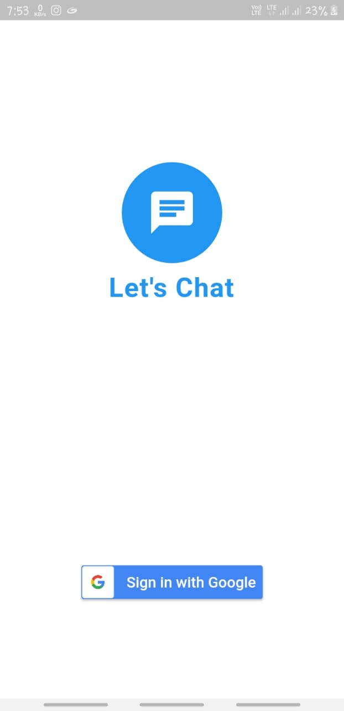
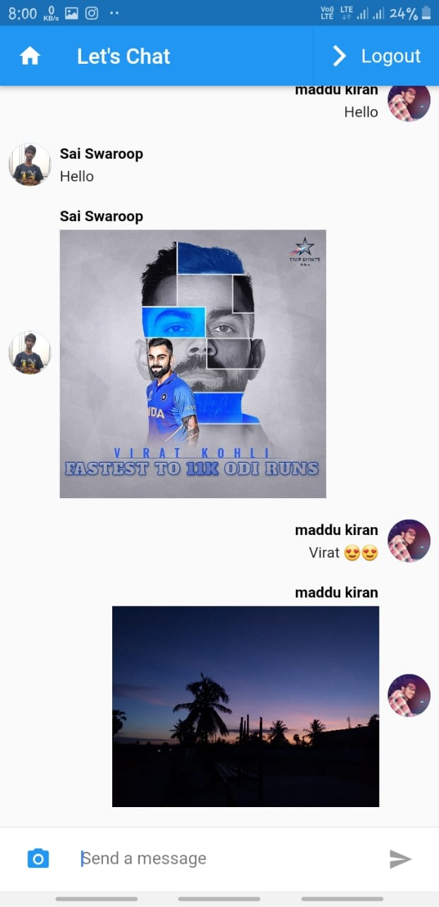

# LetsChat_Flutter
 A Chat application using Flutter with Google Authentication and image sharing capability where connected users can share messages and images using Firebase. It will be having two-screens, in first screen (login screen), we’ll have a screen where a user can login using Google account and in the second screen you can send messages and images.
 
 For help getting started with Flutter, view the online <a href="https://flutter.dev/">documentation</a>.

 You can check out the corresponding Google code lab <a href="https://codelabs.developers.google.com/codelabs/flutter/index.html#8">here</a>.
<p align="center">
   
  &nbsp;&nbsp;&nbsp;&nbsp;&nbsp;&nbsp;&nbsp;&nbsp;&nbsp;&nbsp;&nbsp;&nbsp;
 
 
 </p>


## Getting started
 * Setup your Flutter studio ready for development.
 * Go to http://console.firebase.google.com/ and create and register your application in firebase follow the instructions given there while registering your application.
 * Place your google-services.json file in android/app 
 
## Dependencies

  * google_sign_in: ^4.0.1+3
  * firebase_auth: ^0.11.1
  * firebase_analytics: ^3.0.3
  * firebase_storage: ^3.0.2
  * image_picker: ^0.6.0+10
  * firebase_database: ^3.0.2
  * flutter_auth_buttons: ^0.5.0
 
## Installing
  * In the command terminal, run the following commands:
    ```  
     $ git clone git@github.com:swaroopmaddu/LetsChat_Flutter
     $ cd LetsChat_Flutter/
     $ flutter run
    ```
  * In android studio go to File > New > Project from Version Control > Git
  
      ```
       * Copy Paste https://github.com/swaroopmaddu/LetsChat_Flutter/ in URL
       * Proceed to Clone
       * Close the Project and open it again
      ```
## License

MIT License

Copyright (c) 2019 Swaroop Maddu

Permission is hereby granted, free of charge, to any person obtaining a copy of this software and associated documentation files (the "Software"), to deal in the Software without restriction, including without limitation the rights to use, copy, modify, merge, publish, distribute, sublicense, and/or sell copies of the Software, and to permit persons to whom the Software is furnished to do so, subject to the following conditions:

The above copyright notice and this permission notice shall be included in all copies or substantial portions of the Software.

THE SOFTWARE IS PROVIDED "AS IS", WITHOUT WARRANTY OF ANY KIND, EXPRESS OR IMPLIED, INCLUDING BUT NOT LIMITED TO THE WARRANTIES OF MERCHANTABILITY, FITNESS FOR A PARTICULAR PURPOSE AND NONINFRINGEMENT. IN NO EVENT SHALL THE AUTHORS OR COPYRIGHT HOLDERS BE LIABLE FOR ANY CLAIM, DAMAGES OR OTHER LIABILITY, WHETHER IN AN ACTION OF CONTRACT, TORT OR OTHERWISE, ARISING FROM, OUT OF OR IN CONNECTION WITH THE SOFTWARE OR THE USE OR OTHER DEALINGS IN THE SOFTWARE.
